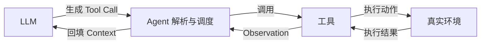

## git/gh 理论最简单提交远端方法
- 暂存所有变更
```
git add -A
```
这里-a表示所有
- 提交
```
git commit -m "..."
```
-m是--message的缩写
- 推送到远端
```
git push
```

## llm如何通过agent触碰真实环境

- llm只能输出/接受token序列，本身无法运行指令。
- agent作为一个代理，接受llm的tool call，放到实际环境中运行，再将Observation作为新的context回传llm。



  

##### 
